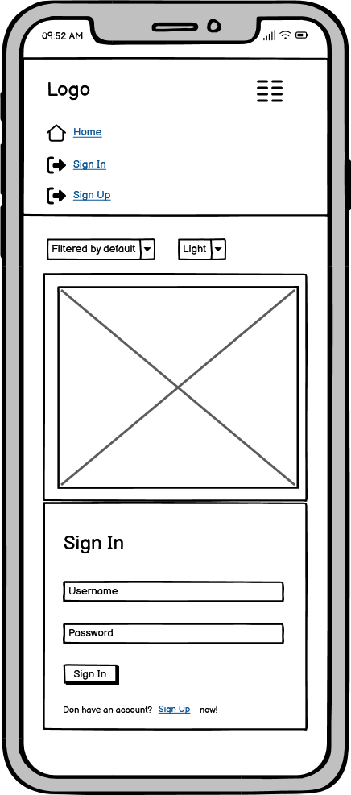
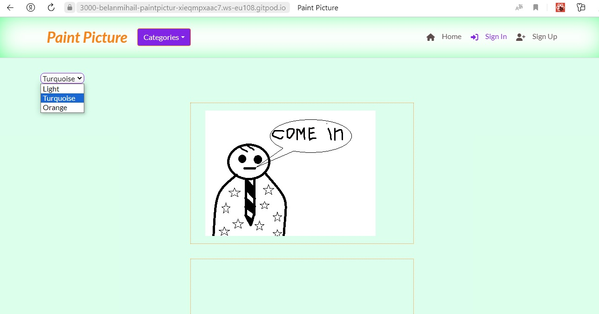
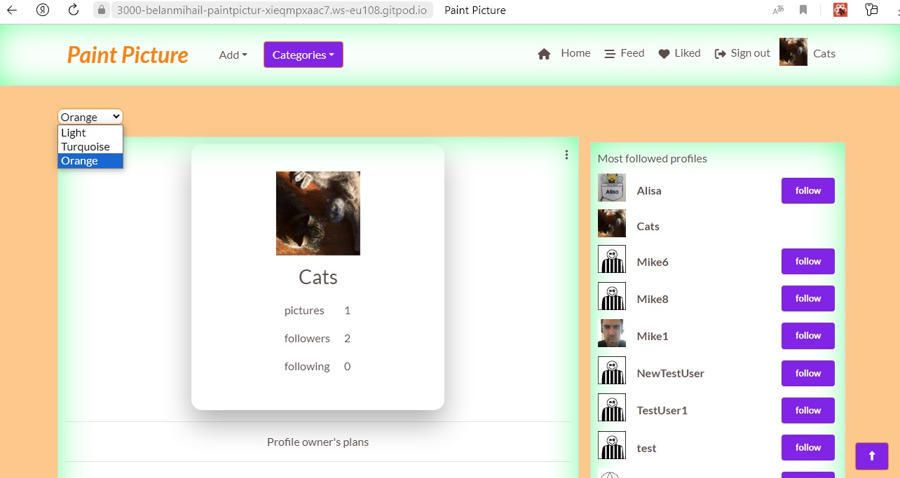
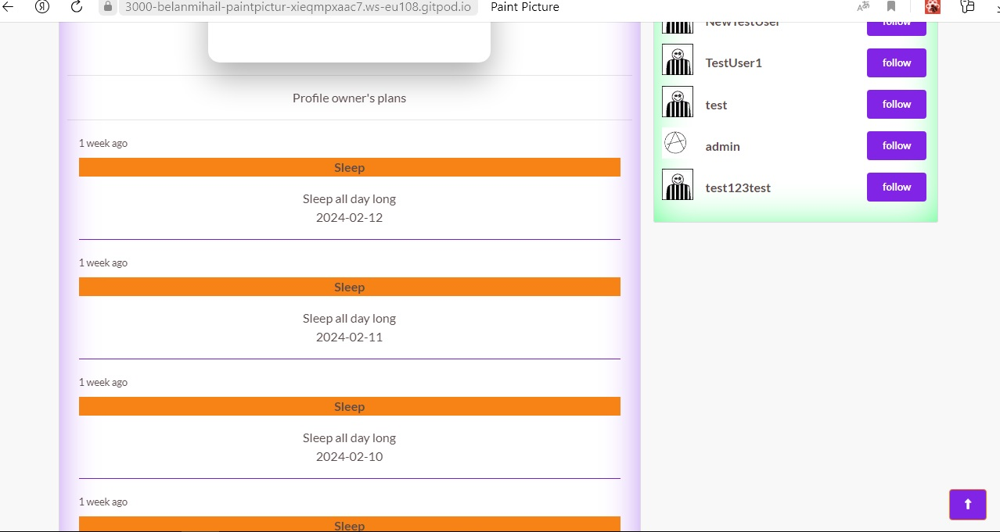
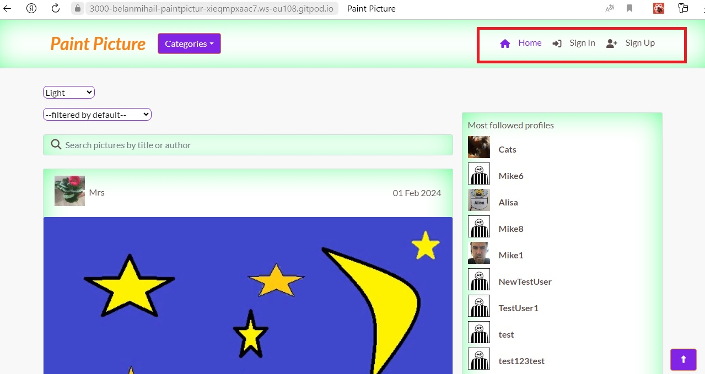
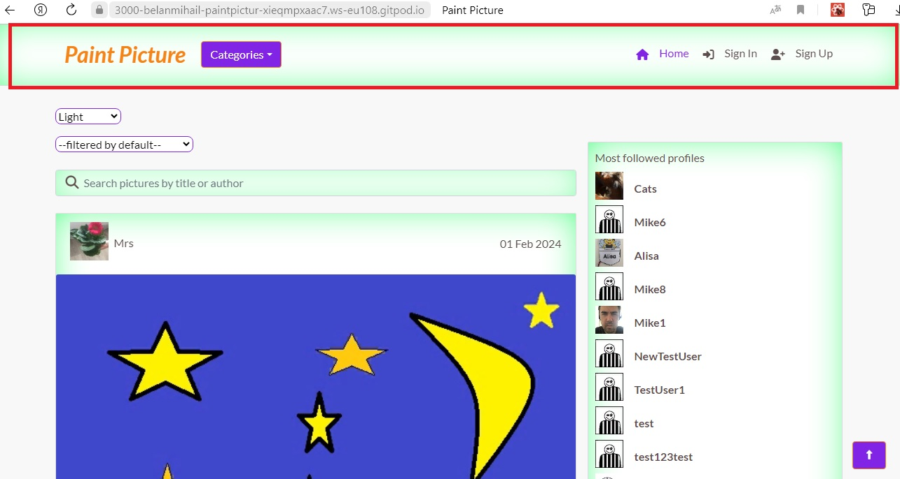
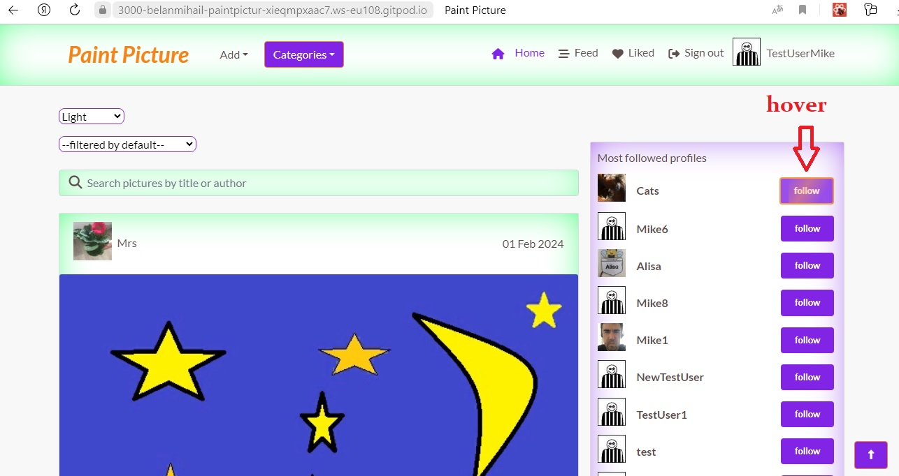
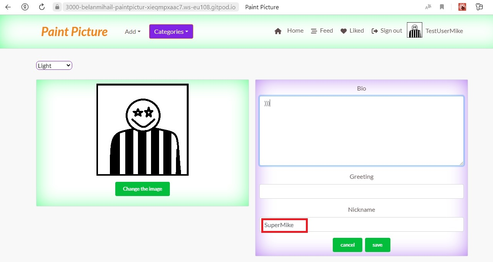

# Paint Picture

Developer: Bilan Mykhailo

[View live website](https://paint-picture-frontend-29a39ba64062.herokuapp.com/)

## Table of Contents
  1. [About](#about)
  2. [Project Goals](#project-goals)
  3. [User Experience](#user-experience)
        1. [Target Audience](#target-audience)
        2. [User Requirements and Expectations](#user-requirements-and-expectations)
        3. [User Stories](#user-stories)
        4. [Site owner Stories](#site-owner-stories)
  4. [Design](#design)
        1. [Agile Design](#agile-design)
        2. [CRUD Functionality](#crud-functionality)
        3. [Colors](#colors)
        4. [Fonts](#fonts)
        5. [Wireframes](#wireframes)
  5. [Technologies Used](#technologies-used)
        1. [Languages](#languages)
        2. [Libraries, frameworks and dependencies](#libraries-frameworks-and-dependencies)
        3. [Tools & Programs](#tools--programs)
   6. [Front-End](#front-end)
      1. [React](#react)
         1. [Front-End Components](#front-end-components)
         2. [Front-End Pages](#front-end-pages)
   7. [Back-End](#back-end)
      1. [Django Rest Framework](#django-rest-framework)
   8. [Features](#features)
      1. [Features Components](#features-components)
      2. [Features Pages](#features-pages)
   9. [Testing](#testing)
      1. [Manual testing of user stories](#manual-testing-of-user-stories)

## About

PainPicture is a platform where users can share pictures they made with Paint.
Everyone can like or comment other users' pictures. Users can also create Wall, create and share your plans and follow their favourite user. 

## Project Goals

The goal for this project was to build a platform to enable users to interact with others in various ways such as creating pictures, commenting pictures, like pictures or following their profile.

The key functionality aspects:
- simple and intuitive navigation across all pages
- user authentication
- user interaction via pictures, comments, likes, followers, planns, wallitems
- user profiles with their description, greetin, statistic and images
- CRUD functionality for pictures, comments, likes, followers, planns, wallitems and profile information
- pictures filtering by title, author and category, liked posts and followed users posts, likea and comments count (low to high and high to low)
- responsiveness to allow users use the app on various devices

## User Experience

### Target Audience

- People who likes graphics editor Piant 
- People who love to draw and want to share their creativity with others
- People who are looking for interesting content and additional communication with creative people

### User Requirements and Expectations

- A site which provides a high level of interactiveness between users
- A site with a clear purpose
- An user-friendly interface that allows quick and efficient navigation
- Responsive and visually good design
- User interaction and app feedback through the use of animations and notifications
- Сontent of a certain category

### User Stories

1. As User I can registrate on the site so that I can use the full functionality of the site
2. As User I can Logout from the site so that I can prevent others from using my site
3. As User I can see Navbar on every page of the site so that I can easily go to another page on the site
4. As User I can I want the main functionality to be displayed on the navbar (adding a post, adding plans, logging in. logging out) so that I can use the basic functionality on any page of the site
5. As User I can the site responded to my actions so that I feel the complete interaction with me as a user
6. As User I can change the color theme of the site so that I can choose the site color scheme that suits me best
7. As User I can when I first visit the site, I will receive a description of the site's contents so that I will understand the theme of the site and my interest in it
8. As User I can get a profile after registration so that I can use my profile page after registration
9. As User I can edit my profile so that I can change my details
10. As User I can edit username and password so that I can change my data specified during registration
11. As User I can view my own post-pictures on my profile page so that I can see the content I added
12. As User I can post enlarged avatar picture on profile page so that other users can see the full picture of my avatar
13. As User I can see user statistics on the site on profile page so that I can know how many posts a user has added, how many people he has followed and how many people have followed him
14. As User I can see greeting when hovering over avatar so that I can see the user's greeting
15. As User I can see popular profiles so that I can understand which users are the most interesting
16. As Authenticated User I can add a post-picture so that I can add my content to the site
17. As User I can edit my post-pictures so that I can change the content of the content I add
18. As User I can see notifications about empty fields so that I can understand which field should not be empty
19. As User I can delete my own post-picture so that I can delete my post-picture if I want to
20. As User I can determine the category of the picture so that the category of the image will be determined, making it searchable by the specified category
21. As User I can change picture category so that I can change the wrong category
22. As User I want each category to have its own color so that I can easily distinguish the post category
23. As User I can see the number of likes a picture-post has so that I can see which posts are the most popular
24. As User I can see number of comments which a picture-post has so that I can see which posts are the most popular
25. As User I can see picture-post detail so that I can view a specific picture-post
26. As User I can see date of picture-post so that I can understand the relevance of the content
27. As User I can see all post-pictures on the home page so that I can immediately familiarize myself with the main content of the site
28. As User I can filter picture-posts by category so that I can view picture-posts of the category I'm interested in
29. As User I can filter picture-posts by number of likes so that I can filter the most interesting posts for viewing
30. As User I can filter picture-posts by number of comments so that I can see the most commented picture-posts
31. As User I can I can filter picture-posts based on the likes I gave so that I can see picture-posts that I like
32. As User I can Search picture-posts by title and author's name so that I can find certain picture-posts
33. As User I can create WallItem so that I can leave public messages on the wall
34. As User I can edit WallItem so that I can edit public messages on the wall
35. As User I can delete WallItem so that I can delete my own public messages on the wall
36. As User I can create Plans so that I can tell other users about my plans
37. As User I can edit Plans so that I can change my own plans
38. As User I can delete Plans so that I can delete plans that are no longer relevant to me
39. As User I can create Comments so that I can express your opinion about other users' pictures-post
40. As User I can edit Comments so that I can change my opinion about other users' pictures-post
41. As User I can delete Comments so that I can delete my opinion about other users' pictures-post

### Site Owner Stories

42. As a site owner I can provide full access to logged in user so that they can interact with the pages more independently
43. As a site owner I can restrict the interaction with website so that an unauthorised user cannot make changes in the app
44. As a site ownerI can when loading for the first time, display only the last 10 picture-posts so that I can avoid overloading the server and speed up the loading of the site
45. As a site owner I can use infinite scroll so that I can achieve display of new picture-posts after the user views previously loaded picture-posts
46. As a site owner, I would want the site to be fully responsive so that users can use it across multiple devices and create a good user experience.

## Design

### Agile Design

- create Issue Template
   

Issue template

   
   

- create Milestones
   

Milestones

   
   

- create project [Link to project](https://github.com/users/Belan-Mihail/projects/8)
- create issues (based on the template). A total of 46 issues were created
   

Issues

   
   

- create main labels and mark issues in accordance with Moscow Prioritisation
   

Labels

   
   

- create Kanban Board to visualize the process of completing tasks
   

Kanban Board

   
   

This project was the second time I used agile development methods. The importance of these principles is beyond doubt. There may have been certain inaccuracies in the use of all the principles of this methodology.

### CRUD Functionality

Paint Picture app handles data with full CRUD Functionality:
- Create -  Users can create, an account, profile, pictures, comments, plans, wallitems messages and watch objects.
- Read - Users can view the pictures, comments, plans, wallitems of other users and also the profiles of these users.
- Update - Users can update their profile, password, username, pictures, comments, plans, wallitems 
- Delete - Users can delete pictures, comments, plans, wallitems.

### Colors
- The main colors used in the sites were selected using the application [Coolors](https://coolors.co/?home). 

Colors Palette

### Fonts
- Google Fonts were implemented on the website. The main font used on the site is Lato. For individual elements of the site, different font weights were used.

### Wireframes
 
- [Balsamiq](https://balsamiq.com/) was used to create frame of project

Home Page

Home Page Fullscreen

Home Page Ipad

Home Page Mobile

Add Picture Page

Add Picture Page Fullscreen

Add Picture Page Ipad

Add Picture Page Mobile

Add Plan Page

Add Plan Page Fullscreen

Add Plan Page Ipad

Add Plan Page Mobile

Picture Page

Picture Page Fullscreen

Picture Page Ipad

Picture Page Mobile

Profile Page

Profile Page Fullscreen

Profile Page Ipad

Profile Page Mobile

Sign In Page

Sign In Page Fullscreen

Sign In Page Ipad

Sign In Page Mobile

Sign Up Page

Sign Up Page Fullscreen

Sign Up Page Ipad

Sign Up Page Mobile

Edit Profile Page

Edit Profile Page Fullscreen

Edit Profile Page Ipad

Edit Profile Page Mobile

Edit Username Page

Edit Username Page Fullscreen

Edit Username Page Ipad

Edit Username Page Mobile

Edit Password Page

Edit Password Page Fullscreen

Edit Password Page Ipad

Edit Password Page Mobile

Edit Picture Page

Edit Picture Page Fullscreen

Edit Picture Page Ipad

Edit Picture Page Mobile

Edit Plan Page

Edit Plan Page Fullscreen

Edit Plan Page Ipad

Edit Plan Page Mobile

## Technologies Used

### Languages

- HTML
- CSS
- Javascript
- React (17.0.2)

### Libraries, frameworks and dependencies

- [Axios](https://axios-http.com/docs/intro) - axios was used to send API requests from the React project to the API and avoid any CORS errors when sending cookies.
- [JWT](https://jwt.io/) - JWT was used to prevent unauthenticated user from making extra network requests to refresh their access token. Also used to remove the timestamp from the browser when the user refreshes token expires or the user logs out.
- [Popper](https://popper.js.org/) - Popper was used to make sure the dropdown menus position is fixed on all browsers.
- [React 17](https://17.reactjs.org/) - was used for building user interfaces
- [React-Bootstrap 4.6](https://react-bootstrap-v4.netlify.app/) - Bootstrap React library was used for UI components, styling and responsiveness.
- [React Infinite Scroll](https://www.npmjs.com/package/react-infinite-scroll-component) - was used this component to load content (pictures/comments/plans/wallitems) automatically as the user scrolls towards the bottom of the page without having to jump to next/previous page.
- [React Router](https://v5.reactrouter.com/web/guides/quick-start) - was used for dynamic routing and to enable the navigation among views of various components and control what the user sees depending on the URL they have accessed in the browser.
- [AOS](https://michalsnik.github.io/aos/) - was used to add animation to the site
- [Prettier](https://prettier.io/): This extension was used to format code for all files

### Tools & Programs

- [Am I Responsive](http://ami.responsivedesign.is/) was used to create the multi-device mock-up at the top of this README.md file
- [Balsamiq](https://balsamiq.com/) to create the projects wireframes
- [Chrome dev tools](https://developers.google.com/web/tools/chrome-devtools/) was used for debugging of the code and checking site for responsiveness
- [Cloudinary](https://cloudinary.com/) to store static files
- [Coolors](https://coolors.co/?home) was used to create the color scheme palette
- [Favicon.io](https://favicon.io) for making the site favicon
- [Font Awesome](https://fontawesome.com/) - Icons from Font Awesome were used throughout the site
- [Google Fonts](https://fonts.google.com/) - import of Inter font
- [Git](https://git-scm.com/) was used for version control within VSCode to push the code to GitHub
- [GitHub](https://github.com/) was used as a remote repository to store project code
- [Gitpod](https://gitpod.io) was used to host a virtual workspace
- [Heroku Platform](https://heroku.com/) was used to deploy the project into live environment
- [Box Shadow](https://box-shadow.dev/) was used to create box-shadow styles for elements and components
- [Paint](https://getpaint.net/) - was used to create pictures-content
- Validation:
  - [WC3 Validator](https://validator.w3.org/) was used to validate the html
  - [Jigsaw W3 Validator](https://jigsaw.w3.org/css-validator/) was used to validate the css
  - [ESLint](https://eslint.org/) used to validate JSX code
  - [Lighthouse](https://developers.google.com/web/tools/lighthouse/) used to validate performance, accessibility, best practice and SEO of the app
  - [Wave](https://wave.webaim.org/) - used to evaluate application accessibility

## Front-End

### React

The library for web and native user interfaces ([source](https://react.dev/)).

I used React for this application for several reasons:
- Speed - applying React significantly increases the page loading speed and reducing the wait, which affects user experience and satisfaction
- Flexibility - the React code is easier to maintain and is flexible due to its modular structure, compared to other front-end frameworks
- React Bootstrap - excellent choice for improving user experience, used for styling and responsiveness. It comes with ready-to-use React built components. They are implemented with accessibility in mind, which is a vital factor when creating a front-end application. I used plain Bootstrap in my previous projects, so it was an easy choice to use React Bootstrap in this app.
- Most used library for developing social networking and media content applications 
- Reusability of components - no need to write various codes for the same features

#### Front-End Components

- `<Asset />` - a multi-purpose component used to display a number of elements while the main component receives data from the server. it includes: a loading spinner from React Bootstrap, image with source and alt attribute or a message consisting of a paragraph. (**User stories covered: 45**)

- `<Avatar />` - resuable component, used to render profile images in the UI. Passed props allow for setting image source and size, adjust image dimensions depending on where the component is rendered. This component also displays the user's greeting. Example of use include the `<NavBar />` component, Picture page or Profile page. (**User stories covered: 12, 14**)

- `<Greeting Modal />` - a component that is used to display general information about the site when user first visit it. (**User stories covered: 7**)

- `<ModeSwitch />` - a component that is used to switch the color scheme of the site with available values: light, turquoise and orange. This component appears on every page of the site under the navigation component. (**User stories covered: 6**)

- `<DropdownMenu />` - reusable component, used to render the dropdown menu which is used to provide the user with the ability to edit or delete their own pictures, plans, wallitems and comments, and also edit their profile or change profile password. (**User stories covered: 5, 9, 10, 17, 19,34, 37, 40**)

- `<NavBar />` - reusable component with the content depending on the login status of the user. For logged in user it shows icon link to add picture and plan, home page and user avatar/picture. For those who are not logged in, it displays icon links to sign up or log in instead of the avatar. The component is used on each page of the app. (**User stories covered: 1, 2, 3, 4 16, 36, 42, 43**)

- `<NotFound />` - specific component for displaying a 404 graphic error message with a return to menu button when user enters the url which does not exist. (**User stories covered: 5**)

- `<PictureOrderingFilter />` reusable component which will allow user to set the order of display of pictures depending on the number of likes (high and low) and also depending on the number of comments (high and low) (**User stories covered: 29, 30**)

- `<ToTop />` reusable component which will allow user rise to the top of the page after, which increases the level of usability of the site. this component is displayed on pages where the user can “go down a lot” for example: Pictures Page, Profile Page  (**User stories covered: 5**)

#### Front-End Pages
___
- SignInForm.js - This file handles the Log in form (**User stories covered: 4, 42**)
- SignUpForm.js - This file handles the Sign up form (**User stories covered: 1, 4, 43**)
___
- Picture.js - This file is designed to display the picture as a section. It contains the functions of like or dislike and picture editing.(**User stories covered: 17, 20, 23, 24, 26**)
- PictureCreateForm.js - This file handles the create picture form (**User stories covered: 16**)
- PictureEditForm.js - This file handles the edit picture form (**User stories covered: 17, 18, 28**)
- PicturePage.js -This file is intended for detail of one picture (**User stories covered: 19, 21, 22, 25**)
- PicturesPage.js -This file returns the list of pictures (**User stories covered: 27, 44, 45**)
___
- Comment.js - This file returns the comments (**User stories covered: 24, 39, 41**)
- CommentEditForm.js - This file handles the comment edit form (**User stories covered: 40**)
- CommentCreateForm.js - This file handles the create comment form (**User stories covered: 39**)
___
- Profile.js - This file returns the profile section (**User stories covered: 12, 13**)
- ProfilePage.js - This file returns the entire Profile page. this is the file responsible for displaying the user’s plans, wall items, posts and his statistics on the site (**User stories covered: 8, 11, 12, 13**)
- PopularProfiles.js - This file returns the users of the site as per the pictures count they posted (**User stories covered: 15**)
- ProfileEditForm.js - This file handles the profile edit form (**User stories covered: 17**)
- UsernameForm.js - This file handles the username change form (**User stories covered: 10**)
- UserPasswordForm.js - This file handles the password change form (**User stories covered: 10**)
___
- Plan.js - This file returns the plans (**User stories covered: 38**)
- PlanEditForm.js - This file handles the plans edit form (**User stories covered: 37**)
- PlanCreateForm.js - This file handles the create plans form (**User stories covered: 36**)
___
- WallItem.js - This file returns the plans (**User stories covered: 35**)
- WallItemEditForm.js - This file handles the plans edit form (**User stories covered: 34**)
- WallItemCreateForm.js - This file handles the create plans form (**User stories covered: 33**)

## Back-End 

### Django REST Framework

The API for this Front-End application was built with the Django REST Framework. The repository with a README file for the Back-End project can be found ([here](https://github.com/Belan-Mihail/drf_api_paint_picture)).

## Features

### Features Components

`Navbar`
- Featured and consistent on the all pages (**User stories covered: 3**)
- Contains direct links to sign-up and log-in pages for unlogged users and links to sign-out page to logged users. (**User stories covered: 1, 2, 42, 43**)
- Contains direct links to add picture and add plan pages (**User stories covered: 36, 16**)
- Contains a drop-down menu for displaying pictures by category, as well as links to user pictures for to pages with pictures of users of which the user is a subscriber and pictures that the user liked (**User stories covered: 31, 28**)
- The nav bar is fully responsive and changes to a toggler (hamburger menu) on smaller size screens (**User stories covered: 46**)

Navbar

___

`GreetingModal`
- appears on the home page when user first visit the site
- contains brief information about the site as well as links to the page for sign up and sign in
(**User stories covered: 7**)

GreetingModal

____

`Asset`
- appears on the many pages of the site.
- can display an image, text (used to notify the user about the lack of results) and a spinner (used during fetching server data for the main component)
(**User stories covered: 5, 45**)

Asset

____

`Avatar`
- appears on the many pages of the site.
- used to render profile images in the UI. Passed props allow for setting image source and size, adjust image dimensions depending on where the component is rendered. 
- also displays the user's greeting if it consist.
(**User stories covered: 12, 14**)

Avatar

____

`ModeSwitch`
- appears on all pages of the site.
that is used to switch the color scheme of the site with available values: light, turquoise and orange.
(**User stories covered: 6**)

ModeSwitch

____
`MoreDropdown`
- appears on the many pages of the site.
- used to render the dropdown menu which allows user to edit or delete their own pictures, plans, wallitems and comments, and also edit their profile or change profile password
(**User stories covered: 5, 9, 10, 17, 19,34, 37, 40**)

MoreDropdown

____
`PictureOrderingFilter`
- appears on Home Page.
- component is used to set the order of display of pictures depending on the number of likes (up and down) and also depending on the number of comments (up and down)
(**User stories covered: 29, 30**)

PictureOrderingFilter

____
`NotFound` 
- it used for displaying a 404 graphic error message with a return to menu button when user enters the url which does not exist.
  (**User stories covered: 5**)

NotFound

____
`ToTop`
- it allow user rise to the top of the page after, which increases the level of usability of the site. this component is displayed on pages where the user can “go down a lot” for example: Pictures Page, Profile Page (**User stories covered: 5**)

ToTop

### Features Pages

`Home page`
- The page includes many components (for example: NavBar, SwitchMode, PictureFilteringMode, PicturesPage, PopularProfiles) and is located at the application's source address
- Сontains a field for searching pictures by author or title (**User stories covered: 32**)
- Contains the output of all site posts with the infinity scroll function (**User stories covered: 27, 44, 45**)
- Contains the output of popular profiles. When you hover over a user's avatar, a greeting message is shown (**User stories covered: 14, 15**)
- The page is responsive and displays well in various screen extensions (**User stories covered: 46**)

Home Page

____
`Sign Up Page`
- This page consists of sign up form for user to create new account.
- Contains a welcome image and a form with username, password, and password confirmation fields. The form has field validation
- This page is not available to authorized users. a redirect is used for this
(**User stories covered: 1, 18, 42, 43**)

Sign Up

____
`Sign In Page`
- This page consists of sign inform for user to log in.
- Contains a welcome image and a form with username and password fields. The form has field validation
- This page is not available to authorized users. a redirect is used for this
(**User stories covered: 1, 18, 42, 43**)

Sign In

____
`Add/Edit Picture Page`

- These pages consist of form for add/edit picture and are only available to logged user.
- Contains a form with title, description, category and image fields. 
- On the editing page, previously entered data is initially available in the corresponding fields
(***User stories covered: 16, 17, 21**)

Add/Edit Picture Page

_____

`Picture Detail Page`
- This page picture detail.
- A component MoreDropdown is available for the authors of the image to delete or edit the image.
- Under the picture there is a form for adding comments and a list of existing comments is displayed.
- Fields have validation
- Contains the output of popular profiles. When you hover over a user's avatar, a welcome greeting is shown
(**User stories covered: 14, 15, 19, 20, 22, 23, 24, 25, 26**)

Picture Detail Page

____

`Add/Edit PLan Page`

- These pages consist of form for add/edit plan and are only available to logged user.
- Contains a form with plans title, plan description, plan date and until fields. 
- On the editing page, previously entered data is initially available in the corresponding fields
(***User stories covered: 36, 37**)

Add/Edit PLan Page

____
`Profile Page`

- Contains a flipping card. On one side of the card there is an avatar, name and statistics of the user on the site information. On the other side there is a short biography of the user and a button (follow/unfollow)
- Also this page contains profile owner's plans, if they are added.
- Below the plans there is a button that switches the display of posts-pictures of the profile owner or his wall
- The profile owner's wall is a place for posting public messages, a form for additions, which is located above the messages. To edit or delete messages, use the MoreDropdown component (available for the message owners)
- For the convenience of the user, there is a ToTop component on the page
(**User stories covered: 8, 11, 12, 13, 33, 34, 35, 36, 37, 38**)

Profile Page

_____
`Edit Profile Page`
- This page consists form to edit profile data.
- Contains a form with bio, nickname, greeting and image fields.
- Previously entered data is initially available in the corresponding fields
(**User stories covered: 9**)

Edit Profile Page

_____

`Edit Username Page`
- This page consists form to edit username.
- Contains a form with single username field.
- Previously entered data is initially available in the corresponding field
(**User stories covered: 10**)

Edit Username Page

_____
`Edit Password Page`
- This page consists form to edit password.
- Contains a form with password and confirm password fields.
- Previously entered data is initially available in the corresponding fields
(**User stories covered: 10**)

Edit Password Page

## Testing
 
### Manual testing of user stories

1. As User I can registrate on the site so that I can use the full functionality of the site

**Step** | **Expected Result** | **Actual Result**
------------ | ------------ | ------------ |
On the main page of the site, click on the sign up link located in the right corner of the navigation menu | The user lands on the sign up page| Works as expected |
Fill out the sign up form and click the sign up button | You will be redirected to the sign in page | Works as expected |
Fill out the sign in form and click the sign in button | You will log into the site and be redirected to the home page| Works as expected |
  

Screenshot

___

2. As User I can Logout from the site so that I can prevent others from using my site

**Step** | **Expected Result** | **Actual Result**
------------ | ------------ | ------------ |
As an authorized user, while on any page of the site, click on the sign out button in the navigation menu | The exit will be carried out | Works as expected |

  

Screenshot

____
3. As User I can see Navbar on every page of the site so that I can easily go to another page on the site

**Step** | **Expected Result** | **Actual Result**
------------ | ------------ | ------------ |
Go to any page of the site | At the top of the site you will find a navigation menu | Works as expected |

Screenshot

_____

4. As User I can I want the main functionality to be displayed on the navbar (adding a post, adding plans, logging in. logging out) so that I can use the basic functionality on any page of the site

**Step** | **Expected Result** | **Actual Result**
------------ | ------------ | ------------ |
As an authorized user, go to any page of the site | At the top of the site you will find a navigation menu with all the listed functions | Works as expected |

Screenshot

_____

5. As User I can the site responded to my actions so that I feel the complete interaction with me as a user

**Step** | **Expected Result** | **Actual Result**
------------ | ------------ | ------------ |
Navigate to different pages of the site | All key components are animated to enhance the user experience | Works as expected |
While on any page of the site, hover your cursor over any component | The hovered component's shadow will change from turquoise to purple to enhance user interaction and feedback on user actions | Works as expected |
When on any page of the site, hover your cursor over a button or link | How to respond to a custom action: a link or button increases in size or changes its color | Works as expected |

Screenshot

______

6. As User I can change the color theme of the site so that I can choose the site color scheme that suits me best

**Step** | **Expected Result** | **Actual Result**
------------ | ------------ | ------------ |
While on any page of the site, hin the left corner there is a select menu for choosing one of the three available color schemes for the site | choose any of the available color schemes | Works as expected |

Screenshot

_____

7. As User I can when I first visit the site, I will receive a description of the site's contents so that I will understand the theme of the site and my interest in it

**Step** | **Expected Result** | **Actual Result**
------------ | ------------ | ------------ |
Open the site for the first time | A welcome modal window with general information about the subject of the site will appear | Works as expected |

Screenshot

____

8. As User I can get a profile after registration so that I can use my profile page after registration

**Step** | **Expected Result** | **Actual Result**
------------ | ------------ | ------------ |
On the main page of the site, click on the sign up link located in the right corner of the navigation menu | The user lands on the sign up page| Works as expected |
Fill out the sign up form and click the sign up button | You will be redirected to the sign in page | Works as expected |
Fill out the sign in form and click the sign in button | You will log into the site and be redirected to the home page| Works as expected |
Click on your avatar located in the upper right corner | You will be taken to your own profile page created automatically after registration | Works as expected |
  

Screenshot

_____

9. As User I can edit my profile so that I can change my details

**Step** | **Expected Result** | **Actual Result**
------------ | ------------ | ------------ |
While on the site, click on your profile avatar in the upper left corner | You will be taken to your profile page | Works as expected |
Click on the three dots in the right-left corner and select the edit profile  | You will be taken to the profile editing page | Works as expected |
Enter the updated data in the appropriate fields and click the save button | Your profile data will be changed | Works as expected |

Screenshot

___

10. As User I can edit username and password so that I can change my data specified during registration

Change username
**Step** | **Expected Result** | **Actual Result**
------------ | ------------ | ------------ |
While on the site, click on your profile avatar in the upper left corner | You will be taken to your profile page | Works as expected |
Click on the three dots in the right-left corner and select the edit username | You will be taken to the username editing page | Works as expected |
Enter the updated data in the appropriate fields and click the save button | Your username will be changed | Works as expected |

Screenshot Username

Change password
**Step** | **Expected Result** | **Actual Result**
------------ | ------------ | ------------ |
While on the site, click on your profile avatar in the upper left corner | You will be taken to your profile page | Works as expected |
Click on the three dots in the right-left corner and select the edit password | You will be taken to the password editing page | Works as expected |
Enter the updated data in the appropriate fields and click the save button | Your password will be changed | Works as expected |

Screenshot Password

____

11. As User I can view my own post-pictures on my profile page so that I can see the content I added

**Step** | **Expected Result** | **Actual Result**
------------ | ------------ | ------------ |
Once on your profile page, scroll down to the profile owner's posts section | You can see your post pictures | Works as expected |

Screenshot

____

12. As User I can post enlarged avatar picture on profile page so that other users can see the full picture of my avatar

**Step** | **Expected Result** | **Actual Result**
------------ | ------------ | ------------ |
While on any page of the site, click on the small picture of your profile avatar | You will be taken to your profile page where an enlarged avatar of your profile is located. | Works as expected |

Screenshot

____

13. As User I can see user statistics on the site on profile page so that I can know how many posts a user has added, how many people he has followed and how many people have followed him

**Step** | **Expected Result** | **Actual Result**
------------ | ------------ | ------------ |
While on any home page, click on any avatar that interests you | you can see the user statistics you are interested in | Works as expected |

Screenshot

_____
14. As User I can see greeting when hovering over avatar so that I can see the user's greeting

**Step** | **Expected Result** | **Actual Result**
------------ | ------------ | ------------ |
While on any home page, hover on any avatar that interests you | you can see the user greeting if it exsist | Works as expected |

Screenshot

_____

15. As User I can see popular profiles so that I can understand which users are the most interesting

**Step** | **Expected Result** | **Actual Result**
------------ | ------------ | ------------ |
Go to the home page or any profile page | You can see a list of popular profiles | Works as expected |

Screenshot

______
16. As Authenticated User I can add a post-picture so that I can add my content to the site

**Step** | **Expected Result** | **Actual Result**
------------ | ------------ | ------------ |
While on any page of the site, click on the add link and select the picture tab | You will be taken to the page for adding picture. | Works as expected |
Fill in the required fields and click create | Your picture will be added and and you will be taken to the picture page | Works as expected |

Screenshot

____

17. As User I can edit my post-pictures so that I can change the content of the content I add

**Step** | **Expected Result** | **Actual Result**
------------ | ------------ | ------------ |
While on the site's home page, click on the image of your post | You will be taken to the picture page | Works as expected |
Click on the three dots and select the edit tab | You will be taken to the picture editing page | Works as expected |
Fill in the required fields that you want to change and click the edit button | Your picture will be updated | Works as expected |

Screenshot

_____

18. As User I can see notifications about empty fields so that I can understand which field should not be empty

**Step** | **Expected Result** | **Actual Result**
------------ | ------------ | ------------ |
Go to any page of the site where you need to fill out a data form (for example, the sign up page) and after filling out the data, click the button (sign up) | If any required field is not filled in, you will see a warning. | Works as expected |

Screenshot

____

19. As User I can delete my own post-picture so that I can delete my post-picture if I want to

**Step** | **Expected Result** | **Actual Result**
------------ | ------------ | ------------ |
While on the site's home page, click on the image of your post | You will be taken to the picture page | Works as expected |
Click on the three dots and select the delete icon | Your picture will be delete  | Works as expected |

Screenshot

____
20. As User I can determine the category of the picture so that the category of the image will be determined, making it searchable by the specified category

**Step** | **Expected Result** | **Actual Result**
------------ | ------------ | ------------ |
Go to the page for adding a picture by clicking on the add link and selecting the pictures tab | You will be taken to the adding picture page | Works as expected |
Select the category of your picture, fill another required fields and click "create" | The corresponding category will be assigned to the picture  | Works as expected |

Screenshot

____
21. As User I can change picture category so that I can change the wrong category

**Step** | **Expected Result** | **Actual Result**
------------ | ------------ | ------------ |
While on the site's home page, click on the image of your post | You will be taken to the picture page | Works as expected |
Click on the three dots and select the edit tab | You will be taken to the picture editing page | Works as expected |
Select another category, fill another required fields and click "edit" | The corresponding category will be assigned to the picture  | Works as expected |

Screenshot

____
22. As User I want each category to have its own color so that I can easily distinguish the post category

**Step** | **Expected Result** | **Actual Result**
------------ | ------------ | ------------ |
Once on the main page, scroll down to view various pictures |Each category has its own color | Works as expected |

Screenshot

_____

23. As User I can see the number of likes a picture-post has so that I can see which posts are the most popular

**Step** | **Expected Result** | **Actual Result**
------------ | ------------ | ------------ |
Once on the main page, scroll down to view various pictures | Each picture has its own number of likes | Works as expected |

Screenshot

_____

24. As User I can see number of comments which a picture-post has so that I can see which posts are the most popular

**Step** | **Expected Result** | **Actual Result**
------------ | ------------ | ------------ |
Once on the main page, scroll down to view various pictures | Each picture has its own number of comments | Works as expected |

Screenshot

_____

25. As User I can see picture-post detail so that I can view a specific picture-post

**Step** | **Expected Result** | **Actual Result**
------------ | ------------ | ------------ |
Being on the home page, select any picture and click on the image | You will be taken to the picture page | Works as expected |

Screenshot

_____

26. As User I can see date of picture-post so that I can understand the relevance of the content

**Step** | **Expected Result** | **Actual Result**
------------ | ------------ | ------------ |
Once on the main page, scroll down to view various pictures | Each picture has its own date | Works as expected |

Screenshot

_____

27. As User I can see all post-pictures on the home page so that I can immediately familiarize myself with the main content of the site

**Step** | **Expected Result** | **Actual Result**
------------ | ------------ | ------------ |
Go to home page | All posts are available for viewing after fetching data from the server | Works as expected |

Screenshot

______

28. As User I can filter picture-posts by category so that I can view picture-posts of the category I'm interested in

**Step** | **Expected Result** | **Actual Result**
------------ | ------------ | ------------ |
While on any page, click on the Categories button located in the navigation menu and select the category you are interested in | You will be redirected to the main page of the site and all posts of the corresponding category will be available for viewing after fetching data from the server | Works as expected |

Screenshot

___

29. As User I can filter picture-posts by number of likes so that I can filter the most interesting posts for viewing

**Step** | **Expected Result** | **Actual Result**
------------ | ------------ | ------------ |
While on Homepage, select the appropriate condition in the select menu located in the upper left above the search field | After fetching the data, the pictures will be ordered by the number of likes | Works as expected |

Screenshot

___

30. As User I can filter picture-posts by number of comments so that I can see the most commented picture-posts

**Step** | **Expected Result** | **Actual Result**
------------ | ------------ | ------------ |
While on Homepage, select the appropriate condition in the select menu located in the upper left above the search field | After fetching the data, the pictures will be ordered by the number of likes | Works as expected |

Screenshot

_____
31. As User I can I can filter picture-posts based on the likes I gave so that I can see picture-posts that I like

**Step** | **Expected Result** | **Actual Result**
------------ | ------------ | ------------ |
While on any page of the site, click on the likes link in the navigation menu | You will be taken to the home page, where after fetching the pictures that have been rated by the user will be displayed | Works as expected |

Screenshot

____
32. As User I can Search picture-posts by title and author's name so that I can find certain picture-posts

**Step** | **Expected Result** | **Actual Result**
------------ | ------------ | ------------ |
While on Home page, you can conduct a query in the search field located above the first picture | you can conduct a query in the search field located above the first picture of the post on the home page after fetching, pictures will be displayed with the name of the author or the titles of which correspond to the search query | Works as expected |

Screenshot

____

33. As User I can create WallItem so that I can leave public messages on the wall

**Step** | **Expected Result** | **Actual Result**
------------ | ------------ | ------------ |
While on Home page, click on the avatar of the user you are interested in | you will be taken to the respective user's profile page | Works as expected |
scroll down to the show wall button and click on it | the profile owner’s wall with a form for adding a message will be displayed on the screen | Works as expected |
enter your message in the text field and click the add messages button | a new message will appear on the profile owner’s wall | Works as expected |

Screenshot

