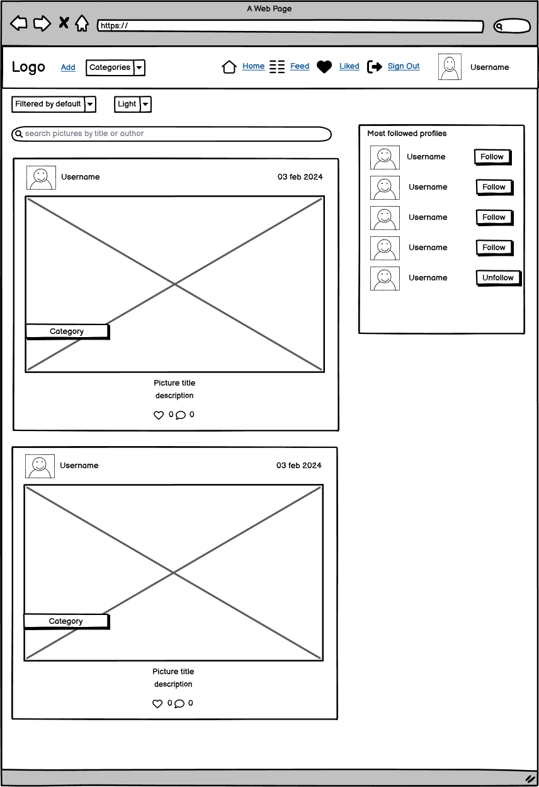
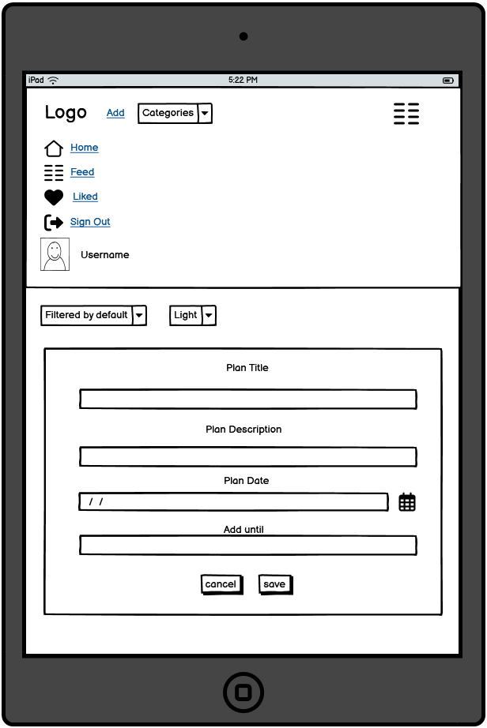
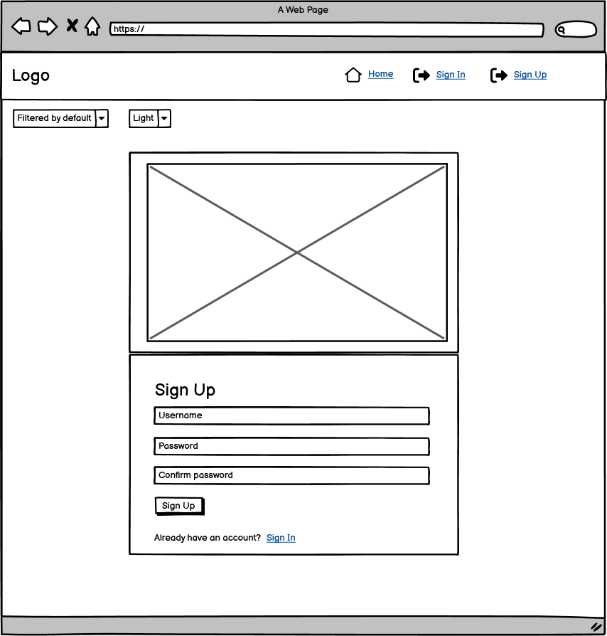
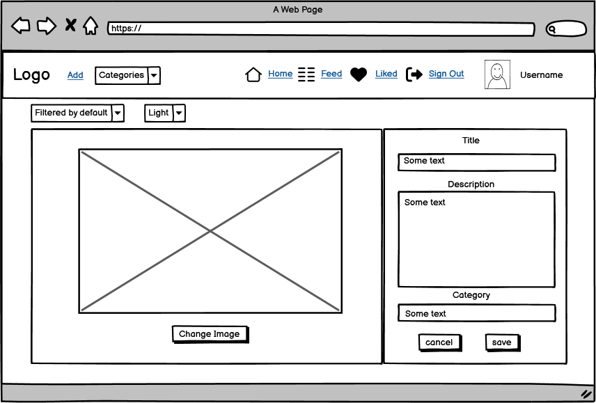

# Paint Picture

Developer: Bilan Mykhailo

[View live website](https://paint-picture-frontend-29a39ba64062.herokuapp.com/)

## Table of Contents
  1. [About](#about)
  2. [Project Goals](#project-goals)
  3. [User Experience](#user-experience)
        1. [Target Audience](#target-audience)
        2. [User Requirements and Expectations](#user-requirements-and-expectations)
        3. [User Stories](#user-stories)
        4. [Site owner Stories](#site-owner-stories)
  4. [Design](#design)
        1. [Agile Design](#agile-design)
        2. [CRUD Functionality](#crud-functionality)
        3. [Colors](#colors)
        4. [Fonts](#fonts)
        5. [Wireframes](#wireframes)
  5. [Technologies Used](#technologies-used)
        1. [Languages](#languages)
        2. [Libraries, frameworks and dependencies](#libraries-frameworks-and-dependencies)
        3. [Tools & Programs](#tools--programs)
   6. [Front-End](#front-end)
      1. [React](#react)

## About

PainPicture is a platform where users can share pictures they made with Paint.
Everyone can like or comment other users' pictures. Users can also create Wall, create and share your plans and follow their favourite user. 

## Project Goals

The goal for this project was to build a platform to enable users to interact with others in various ways such as creating pictures, commenting pictures, like pictures or following their profile.

The key functionality aspects:
- simple and intuitive navigation across all pages
- user authentication
- user interaction via pictures, comments, likes, followers, planns, wallitems
- user profiles with their description, greetin, statistic and images
- CRUD functionality for pictures, comments, likes, followers, planns, wallitems and profile information
- pictures filtering by title, author and category, liked posts and followed users posts, likea and comments count (low to high and high to low)
- responsiveness to allow users use the app on various devices

## User Experience

### Target Audience

- People who likes graphics editor Piant 
- People who love to draw and want to share their creativity with others
- People who are looking for interesting content and additional communication with creative people

### User Requirements and Expectations

- A site which provides a high level of interactiveness between users
- A site with a clear purpose
- An user-friendly interface that allows quick and efficient navigation
- Responsive and visually good design
- User interaction and app feedback through the use of animations and notifications
- Сontent of a certain category

### User Stories

1. As User I can registrate on the site so that I can use the full functionality of the site
2. As User I can Logout from the site so that I can prevent others from using my site
3. As User I can see Navbar on every page of the site so that I can easily go to another page on the site
4. As User I can I want the main functionality to be displayed on the navbar (adding a post, adding plans, logging in. logging out) so that I can use the basic functionality on any page of the site
5. As User I can the site responded to my actions so that I feel the complete interaction with me as a user
6. As User I can change the color theme of the site so that I can choose the site color scheme that suits me best
7. As User I can when I first visit the site, I will receive a description of the site's contents so that I will understand the theme of the site and my interest in it
8. As User I can get a profile after registration so that I can use my profile page after registration
9. As User I can edit my profile so that I can change my details
10. As User I can edit username and password so that I can change my data specified during registration
11. As User I can view my own post-pictures on my profile page so that I can see the content I added
12. As User I can post enlarged avatar picture on profile page so that other users can see the full picture of my avatar
13. As User I can see user statistics on the site on profile page so that I can know how many posts a user has added, how many people he has followed and how many people have followed him
14. As User I can see greeting when hovering over avatar so that I can see the user's greeting
15. As User I can see popular profiles so that I can understand which users are the most interesting
16. As Authenticated User I can add a post-picture so that I can add my content to the site
17. As User I can edit my post-pictures so that I can change the content of the content I add
18. As User I can see notifications about empty fields so that I can understand which field should not be empty
19. As User I can delete my own post-picture so that I can delete my post-picture if I want to
20. As User I can determine the category of the picture so that the category of the image will be determined, making it searchable by the specified category
21. As User I can change picture category so that I can change the wrong category
22. As UserI want each category to have its own color so that I can easily distinguish the post category
23. As User I can see the number of likes a picture-post has so that I can see which posts are the most popular
24. As User I can see number of comments which a picture-post has so that I can see which posts are the most popular
25. As User I can see picture-post detail so that I can view a specific picture-post
26. As User I can see date of picture-post so that I can understand the relevance of the content
27. As User I can see all post-pictures on the home page so that I can immediately familiarize myself with the main content of the site
28. As User I can filter picture-posts by category so that I can view picture-posts of the category I'm interested in
29. As User I can filter picture-posts by number of likes so that I can filter the most interesting posts for viewing
30. As User I can filter picture-posts by number of comments so that I can see the most commented picture-posts
31. As User I can I can filter picture-posts based on the likes I gave so that I can see picture-posts that I like
32. As User I can Search picture-posts by title and author's name so that I can find certain picture-posts
33. As User I can create WallItem so that I can leave public messages on the wall
34. As User I can edit WallItem so that I can edit public messages on the wall
35. As User I can delete WallItem so that I can delete my own public messages on the wall
36. As User I can create Plans so that I can tell other users about my plans
37. As User I can edit Plans so that I can change my own plans
38. As User I can delete Plans so that I can delete plans that are no longer relevant to me
39. As User I can create Comments so that I can express your opinion about other users' pictures-post
40. As User I can edit Comments so that I can change my opinion about other users' pictures-post
41. As User I can delete Comments so that I can delete my opinion about other users' pictures-post

### Site Owner Stories

42. As a site owner I can provide full access to logged in user so that they can interact with the pages more independently
43. As a site owner I can restrict the interaction with website so that an unauthorised user cannot make changes in the app
44. As a site ownerI can when loading for the first time, display only the last 20 picture-posts so that I can avoid overloading the server and speed up the loading of the site
45. As a site owner I can use infinite scroll so that I can achieve display of new picture-posts after the user views previously loaded picture-posts
46. As a site owner, I would want the site to be fully responsive so that users can use it across multiple devices and create a good user experience.

## Design

### Agile Design

- create Issue Template
   

Issue template

   
   

- create Milestones
   

Milestones

   
   

- create project [Link to project](https://github.com/users/Belan-Mihail/projects/8)
- create issues (based on the template). A total of 46 issues were created
   

Issues

   
   

- create main labels and mark issues in accordance with Moscow Prioritisation
   

Labels

   
   

- create Kanban Board to visualize the process of completing tasks
   

Kanban Board

   
   

This project was the second time I used agile development methods. The importance of these principles is beyond doubt. There may have been certain inaccuracies in the use of all the principles of this methodology.

### CRUD Functionality

Paint Picture app handles data with full CRUD Functionality:
- Create -  Users can create, an account, profile, pictures, comments, plans, wallitems messages and watch objects.
- Read - Users can view the pictures, comments, plans, wallitems of other users and also the profiles of these users.
- Update - Users can update their profile, password, username, pictures, comments, plans, wallitems 
- Delete - Users can delete pictures, comments, plans, wallitems.

### Colors
- The main colors used in the sites were selected using the application [Coolors](https://coolors.co/?home). 

Colors Palette

### Fonts
- Google Fonts were implemented on the website. The main font used on the site is Lato. For individual elements of the site, different font weights were used.

### Wireframes
 
- [Balsamiq](https://balsamiq.com/) was used to create frame of project

Home Page

Home Page Fullscreen

Home Page Ipad

Home Page Mobile

Add Picture Page

Add Picture Page Fullscreen

Add Picture Page Ipad

Add Picture Page Mobile

Add Plan Page

Add Plan Page Fullscreen

Add Plan Page Ipad

Add Plan Page Mobile

Picture Page

Picture Page Fullscreen

Picture Page Ipad

Picture Page Mobile

Profile Page

Profile Page Fullscreen

Profile Page Ipad

Profile Page Mobile

Sign In Page

Sign In Page Fullscreen

Sign In Page Ipad

Sign In Page Mobile

Sign Up Page

Sign Up Page Fullscreen

Sign Up Page Ipad

Sign Up Page Mobile

Edit Profile Page

Edit Profile Page Fullscreen

Edit Profile Page Ipad

Edit Profile Page Mobile

Edit Username Page

Edit Username Page Fullscreen

Edit Username Page Ipad

Edit Username Page Mobile

Edit Password Page

Edit Password Page Fullscreen

Edit Password Page Ipad

Edit Password Page Mobile

Edit Picture Page

Edit Picture Page Fullscreen

Edit Picture Page Ipad

Edit Picture Page Mobile

Edit Plan Page

Edit Plan Page Fullscreen

Edit Plan Page Ipad

Edit Plan Page Mobile

## Technologies Used

### Languages

- HTML
- CSS
- Javascript
- React (17.0.2)

### Libraries, frameworks and dependencies

- [Axios](https://axios-http.com/docs/intro) - axios was used to send API requests from the React project to the API and avoid any CORS errors when sending cookies.
- [JWT](https://jwt.io/) - JWT was used to prevent unauthenticated user from making extra network requests to refresh their access token. Also used to remove the timestamp from the browser when the user refreshes token expires or the user logs out.
- [Popper](https://popper.js.org/) - Popper was used to make sure the dropdown menus position is fixed on all browsers.
- [React 17](https://17.reactjs.org/) - was used for building user interfaces
- [React-Bootstrap 4.6](https://react-bootstrap-v4.netlify.app/) - Bootstrap React library was used for UI components, styling and responsiveness.
- [React Infinite Scroll](https://www.npmjs.com/package/react-infinite-scroll-component) - was used this component to load content (pictures/comments/plans/wallitems) automatically as the user scrolls towards the bottom of the page without having to jump to next/previous page.
- [React Router](https://v5.reactrouter.com/web/guides/quick-start) - was used for dynamic routing and to enable the navigation among views of various components and control what the user sees depending on the URL they have accessed in the browser.
- [AOS](https://michalsnik.github.io/aos/) - was used to add animation to the site
- [Prettier](https://prettier.io/): This extension was used to format code for all files

### Tools & Programs

- [Am I Responsive](http://ami.responsivedesign.is/) was used to create the multi-device mock-up at the top of this README.md file
- [Balsamiq](https://balsamiq.com/) to create the projects wireframes
- [Chrome dev tools](https://developers.google.com/web/tools/chrome-devtools/) was used for debugging of the code and checking site for responsiveness
- [Cloudinary](https://cloudinary.com/) to store static files
- [Coolors](https://coolors.co/?home) was used to create the color scheme palette
- [Favicon.io](https://favicon.io) for making the site favicon
- [Font Awesome](https://fontawesome.com/) - Icons from Font Awesome were used throughout the site
- [Google Fonts](https://fonts.google.com/) - import of Inter font
- [Git](https://git-scm.com/) was used for version control within VSCode to push the code to GitHub
- [GitHub](https://github.com/) was used as a remote repository to store project code
- [Gitpod](https://gitpod.io) was used to host a virtual workspace
- [Heroku Platform](https://heroku.com/) was used to deploy the project into live environment
- [Box Shadow](https://box-shadow.dev/) was used to create box-shadow styles for elements and components
- [Paint](https://getpaint.net/) - was used to create pictures-content
- Validation:
  - [WC3 Validator](https://validator.w3.org/) was used to validate the html
  - [Jigsaw W3 Validator](https://jigsaw.w3.org/css-validator/) was used to validate the css
  - [ESLint](https://eslint.org/) used to validate JSX code
  - [Lighthouse](https://developers.google.com/web/tools/lighthouse/) used to validate performance, accessibility, best practice and SEO of the app
  - [Wave](https://wave.webaim.org/) - used to evaluate application accessibility

## Front-End

### React

The library for web and native user interfaces ([source](https://react.dev/)).

I used React for this application for several reasons:
- Speed - applying React significantly increases the page loading speed and reducing the wait, which affects user experience and satisfaction
- Flexibility - the React code is easier to maintain and is flexible due to its modular structure, compared to other front-end frameworks
- React Bootstrap - excellent choice for improving user experience, used for styling and responsiveness. It comes with ready-to-use React built components. They are implemented with accessibility in mind, which is a vital factor when creating a front-end application. I used plain Bootstrap in my previous projects, so it was an easy choice to use React Bootstrap in this app.
- Most used library for developing social networking and media content applications 
- Reusability of components - no need to write various codes for the same features